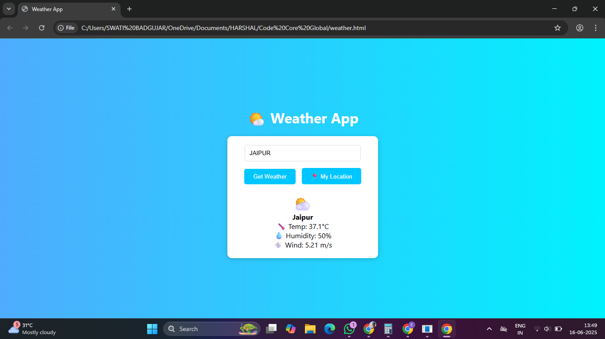

# 🌤️ Weather App

A simple, responsive **Weather App** built with **HTML**, **CSS**, and **JavaScript** that uses the [OpenWeather API](https://openweathermap.org/api) to fetch and display real-time weather data.

---

## 📷 Screenshot

---

## 🚀 Features
- 🌍 Search weather by city name
- 📍 Get weather based on current location
- 🌡️ Display temperature, humidity, and wind speed
- ⛅ Show weather emoji based on conditions
- ⚡ Loading indicator while fetching data
- 📱 Responsive UI

---

## 🛠️ Tech Stack
- HTML5
- CSS3
- JavaScript (Vanilla JS)
- OpenWeather API
  
---

## 🌐 Live Demo
[**View App Here**][(https://hsbadgujar.github.io/weather-app/)]
